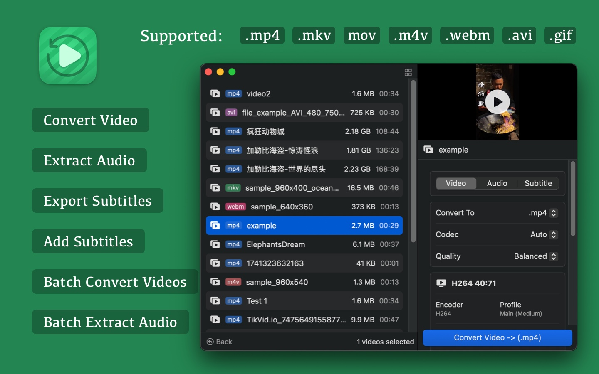
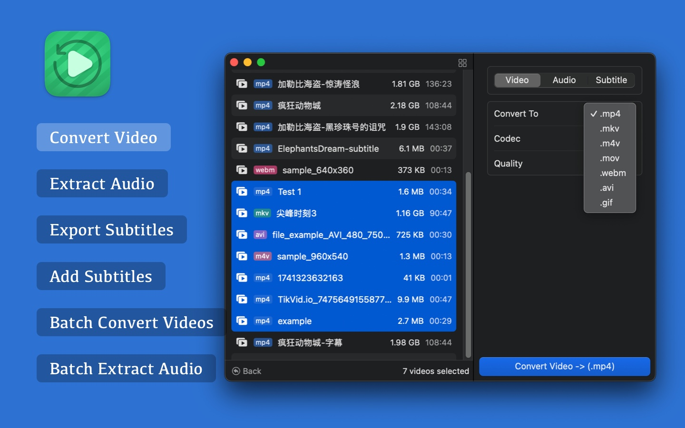
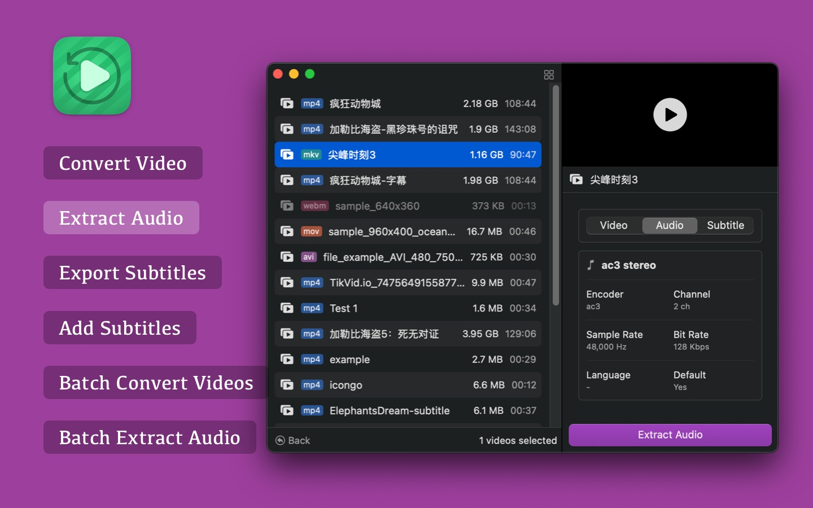
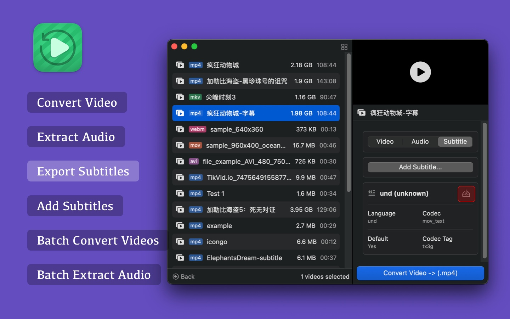
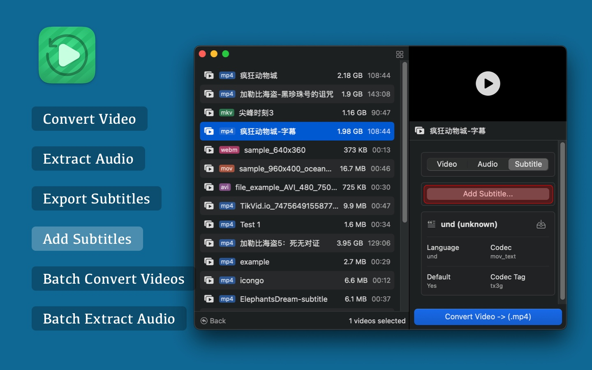

<!--idoc:ignore:start-->
> [!TIP]
> 声明：此项目并非开源项目，仓库作为官方网站，用于收集问题和用户需求。这样做是为了节省成本，因为没有官网，应用无法通过审核。
<!--idoc:ignore:end-->

   
   
  
  <h1>
    Videoer
  </h1>
  <!--rehype:style=border: 0;-->
  

    <a href="./README.zh.md">简体中文</a> • 
    <a target="_blank" href="https://github.com/jaywcjlove/videoer/issues/new?template=bug_report_cn.yml">联系&支持</a> • 
    <a href="https://github.com/jaywcjlove/videoer/releases">变更日志</a>
  

  

    
  

Videoer 是一款功能强大的视频格式转换工具，支持 MP4、MKV、M4V、MOV、WEBM、AVI、GIF 等格式之间的相互转换。无论是单个文件转换还是批量处理，都能轻松完成。同时，Videoer 还提供音频提取、字幕管理等多种实用功能，让你的视频处理更加高效便捷。

### 主要功能

■ 转换视频 - 轻松转换各种主流视频格式，如 MP4、MKV、M4V、MOV、WEBM、AVI、GIF。
■ 提取音频 - 从视频中提取音频，并导出为 mp3, aac, wav, flac, alac, ogg, opus, ac3, eac3, dts, truehd 等格式。
■ 导出字幕 - 解析并提取视频内嵌或外挂的字幕文件（如 SRT、ASS、VTT）。
■ 添加字幕 - 在视频中嵌入字幕，支持多种字幕格式，增强观看体验。
■ 批量转换视频 - 支持多个视频文件同时转换，提升处理效率。
■ 转换大于 1G 的视频 - 轻松处理大文件，保证转换质量。
■ 批量提取音频 - 批量从多个视频中提取音频，适用于音频剪辑或归档。

无论是视频剪辑爱好者、内容创作者，还是需要频繁处理视频文件的专业用户，Videoer 都能满足你的需求，让视频转换变得更加简单高效！

<!--version: v1.0.0-->